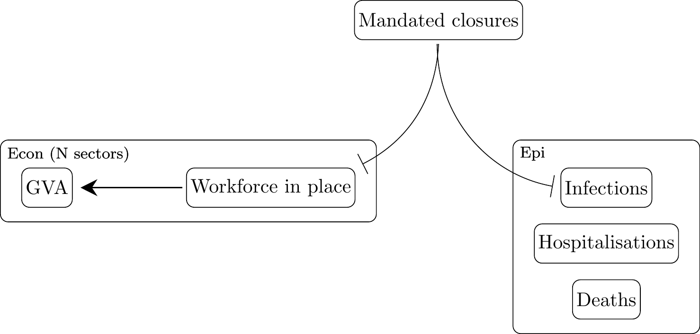
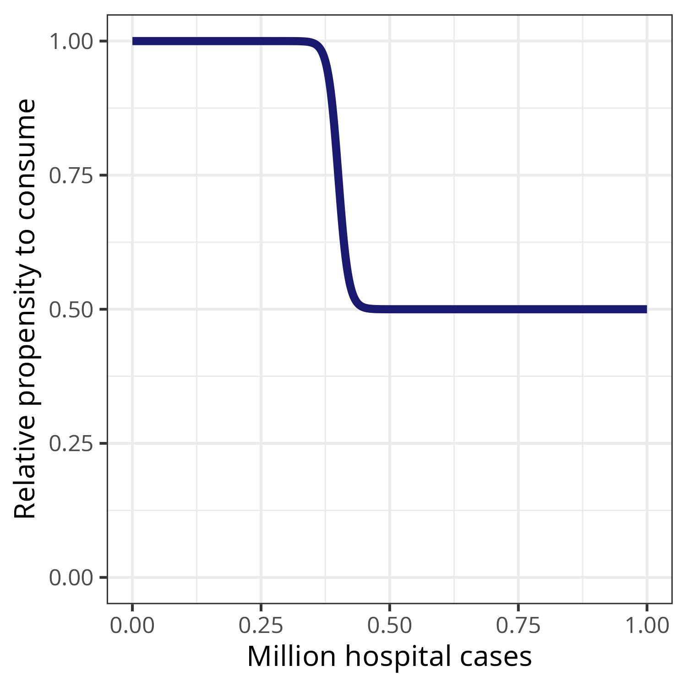
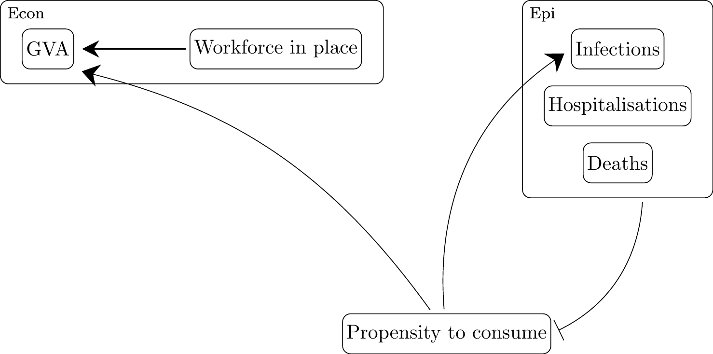
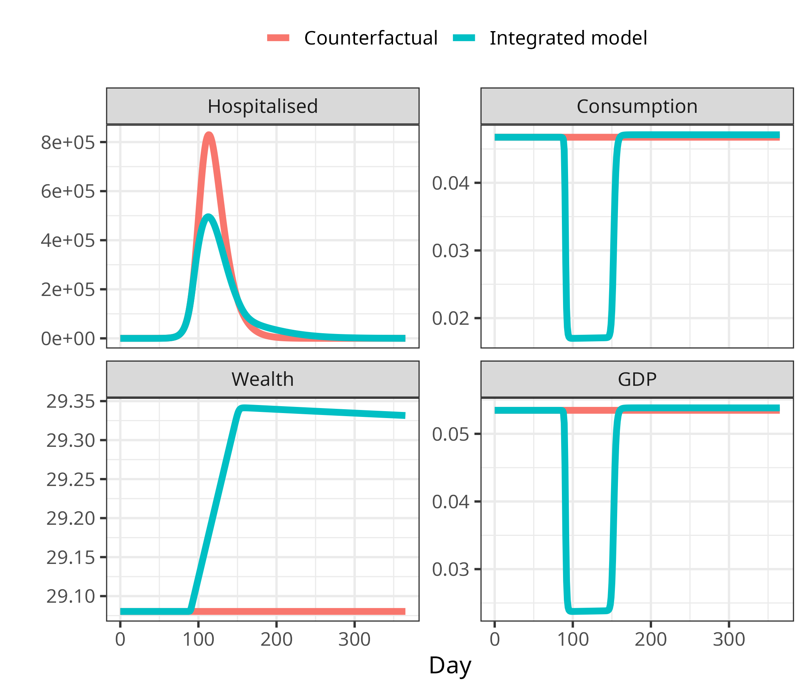
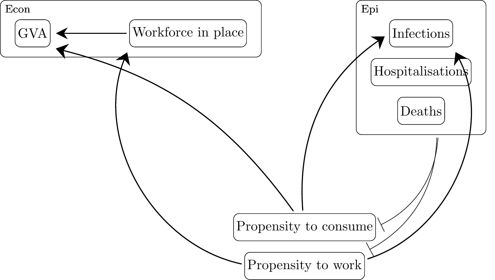
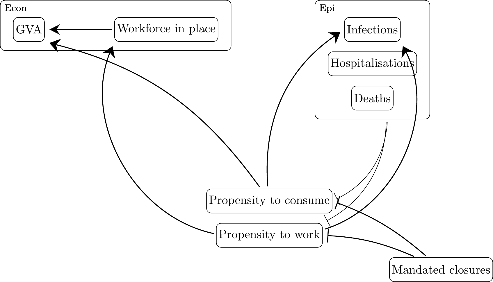
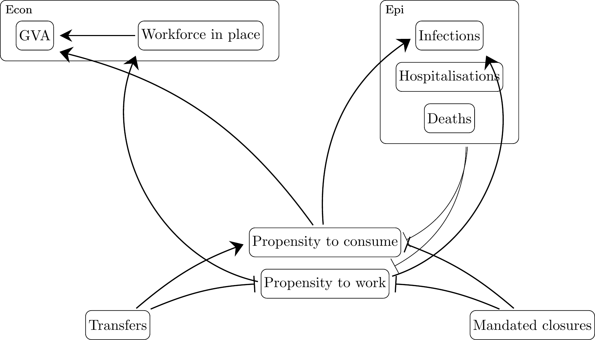
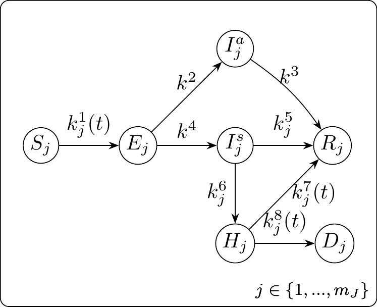

Towards combined epidemiological and economic dynamical systems
================

- [1 DAEDALUS](#1-daedalus)
- [2 SFC-epi](#2-sfc-epi)
  - [2.1 Consumption](#21-consumption)
  - [2.2 Labour supply](#22-labour-supply)
  - [2.3 Mandated closures](#23-mandated-closures)
  - [2.4 Government transfers](#24-government-transfers)
  - [2.5 Other things to consider](#25-other-things-to-consider)
- [3 Epidemic model](#3-epidemic-model)
  - [3.1 Ordinary differential
    equations](#31-ordinary-differential-equations)
  - [3.2 Disease state transitions](#32-disease-state-transitions)
- [4 References](#4-references)

This document describes some combined epi-econ models, starting with
DAEDALUS, and then moving onto SFC-epi models.

Code examples are taken and adapted from
<https://github.com/marcoverpas/Italy-SFC-Model> and
<https://github.com/marcoverpas/Six_lectures_on_sfc_models>.

# 1 DAEDALUS

Originally designed of for the UK (Haw et al. 2022) and since applied to
Indonesia (Johnson et al. 2023). The econ model is static. The
industrial sectors of the economy are used to stratify the population in
the epi model, in which there are contacts related to sector of work and
consumption.

In response to an outbreak, closures are mandated, resulting in
operations in each sector reducing to some percentage. In the model, GVA
reduces to the same percentage, and so does attendance of places of work
and consumption, which scales contacts made and subsequently disease
transmission.

The population is static: it does not grow, and no one changes sector of
work. The non-working group remains non-working. The workforce in place
includes a fraction who work from home and therefore contribute to GVA
but not infections from workplace interactions.

See <https://github.com/robj411/p2_drivers> for a recent presentation.

Figure 1.1: Daedalus model. Mandated closures
reduce both infections and workforce in place.

# 2 SFC-epi

We will use an SFC model in place of GVA by sector. The SFC model is
dynamic in time, meaning impacts can accumulate, and is demand driven,
meaning we can model autonomous behaviour changes that will have impacts
on both the economy and the epidemic.

At present we compute the “propensity to consume/work” which scales the
contacts in the epi model and feeds into the econ model. It might be
better to precompute the counterfactual (without epidemic) consumption
and labour, and:

1.  compute scaled parameters using epi variable(s) and response
    function;
2.  solve econ model to get consumption and labour;
3.  scale contacts with the same ratio as consumption and labour have to
    the no-epidemic counterfactual at the same time point

NB: the model assumes an impact on the general population (i.e. both
susceptibles and infectious change their behaviour). Lack of consumption
and work from people who are already sick *because* they are sick is not
modelled. This could be included explicitly by e.g. setting the
proportion of non-diseased people as the upper bound to propensities.

Figure 2.1: Dose–response
function: extent of behaviour change as a function of an epidemiological
variable such as number of hospital cases.

## 2.1 Consumption

Figure 2.2: Epi variables reduce
propensity to consume, which reduces consumption, and therefore GVA and
new infections.

The first step is to model consumption as a function of the epidemic,
e.g. the number of cases, hospitalisations or deaths. The epidemic
variable modifies the “propensity to consume” parameters (often labelled
$\alpha$). We scale propensity to consume and exposure-related
activities by the same amount.

Figure 2.3: Results for PC model
with consumption reduction alongside counterfactual epi and econ curves
without integration.

## 2.2 Labour supply

Figure 2.4: Epi variables reduce propensity
to work and to consume, which reduces consumption and labour supply, and
therefore GVA and new infections.

Next, we model reduction in propensity to work in the same way.

However, this should ultimately depend also on the need for income,
meaning that (a) lower income people are more likely to work, (b) people
are more likely to work as time goes on and they’ve spent some months
with less income, and (c) we can later mitigate these effects to some
extent with government transfers.

This version of the model (with spontaneous consumption and labour
change) can be used to model an unmitigated epidemic: that is, an
epidemic where there are no government interventions, but the population
can choose infection-avoiding behaviours, which will dampen both the
epidemic and the economy. This is an important gap in current epi
modelling. We usually assume either no behaviour change, so that
unmitigated epidemics have huge death tolls (e.g. UK COVID projection),
or that uncosted (free) population behaviour change will curb the
excesses of the epidemic (CEPI work).

## 2.3 Mandated closures

Figure 2.5: Epi variables reduce
propensity to work and to consume, which reduces consumption and labour
supply, and therefore GVA and new infections. Mandated closures reduce
consumption and propensity to work.

Next we want to introduce the ability for the government to mandate
closures. This might be modelled as e.g. a maximum labour demand,
expressed as a percentage of counterfactual labour demand.

Propose a worked example, such as “how would we model a mandate that the
hospitality sector closes?”

## 2.4 Government transfers

Figure 2.6: Epi variables reduce
propensity to work and to consume, which reduces consumption and labour
supply, and therefore GVA and new infections. Mandated closures reduce
consumption and propensity to work. Government transfers increase
consumption and reduce propensity to work.

We should introduce government transfers to demonstrate that mandated
closures are only sustainable for as long as the population is supported
to forego income in order to stop the spread of infection.

## 2.5 Other things to consider

- international trade, esp. tourism
- structural changes over time?
- move to online consumption

# 3 Epidemic model

The epidemic model is similar to DAEDALUS:

- four age groups (pre-school age, school-age children, working age,
  retirement age)
- working-age people stratified by something: definitely working/not
  working, potentially something sector, occupation or SES related
- seven disease states (S, E, I (symptomatic/asymptomatic), R, H, D)
- no vaccination or waning, for simplicity
- leave school closures out for now, for simplicity
- outputs from the econ model parametrise the function $k_{j}^{1}$

## 3.1 Ordinary differential equations

$$\begin{align}
\frac{dS_{j}}{dt} & = - k_{j}^{1}(t)S_{j}  \\
\frac{dE_{j}}{dt} & = k_{j}^{1}(t)S_{j} - (k^2+k^4)E_{j} \\
\frac{dI_{j}^a}{dt} & = k^2E_{j} - k^3I_{j}^a \\
\frac{dI_{j}^s}{dt} & = k^4E_{j} - (k_{j}^{5}+k_{j}^{6})I_{j}^s \\
\frac{dR_{j}}{dt} & = k^3I_{j}^a + k_{j}^{5}I_{j}^s + k_{j}^{7}(t) H_{j}\\
\frac{dH_{j}}{dt} & = k_{j}^{6}I_{j}^s - (k_{j}^{7}(t) + k_{j}^{8}(t)) H_{j} \\
\frac{dD_{j}}{dt} & =  k_{j}^{8}(t) H_{j}
\end{align}$$

## 3.2 Disease state transitions

Figure 3.1: Disease state
transitions. $S$: susceptible. $E$: exposed. $I^{a}$: asymptomatic
infectious. $I^{s}$: symptomatic infectious. $H$: in need of
hospitalisation. $R$: recovered. $D$: died. $j$: stratum.

# 4 References

Haw, David, Giovanni Forchini, Patrick Doohan, Paula Christen, Matteo
Pianella, Rob Johnson, Sumali Bajaj, et al. 2022. “Optimizing Social and
Economic Activity While Containing SARS-CoV-2 Transmission Using
DAEDALUS.” *Nature Computational Science* 2: 223–33.
<https://doi.org/10.1038/s43588-022-00233-0>.

Johnson, Rob, Bimandra Djaafara, David Haw, Patrick Doohan, Giovanni
Forchini, Matteo Pianella, Neil Ferguson, Peter C Smith, and Katharina D
Hauck. 2023. “The Societal Value of SARS-CoV-2 Booster Vaccination in
Indonesia.” *Vaccine*, no. 41.
<https://doi.org/10.1016/j.vaccine.2023.01.068>.

