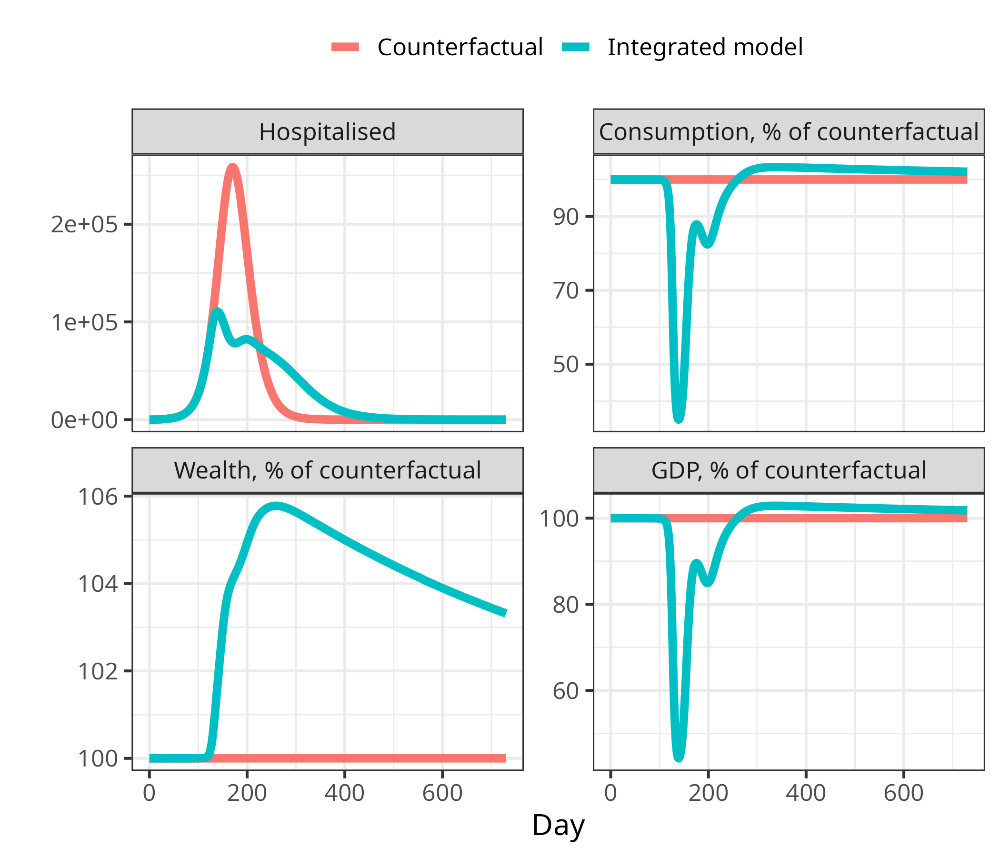

epi-SFC models
================


- [1 Econ models](#1-econ-models)
  - [1.1 Model 1: Integrating consumption and the
    epidemic](#11-model-1-integrating-consumption-and-the-epidemic)
    - [1.1.1 Model attributes](#111-model-attributes)
    - [1.1.2 Initial conditions](#112-initial-conditions)
    - [1.1.3 Resulting trajectories](#113-resulting-trajectories)
  - [1.2 Model 3: Integrating labour supply and the
    epidemic](#12-model-3-integrating-labour-supply-and-the-epidemic)
  - [1.3 Model 4: Integrating imports and exports into the SFC
    model](#13-model-4-integrating-imports-and-exports-into-the-sfc-model)
  - [1.4 Model 5: Integrating government and the
    epidemic](#14-model-5-integrating-government-and-the-epidemic)
  - [1.5 Government transfers](#15-government-transfers)
  - [1.6 Other things to consider](#16-other-things-to-consider)
- [2 Epidemic model](#2-epidemic-model)
  - [2.1 Ordinary differential
    equations](#21-ordinary-differential-equations)
  - [2.2 Disease state transitions](#22-disease-state-transitions)
- [3 Epi to econ response function](#3-epi-to-econ-response-function)

**To run the code**, type

``` r
source('R_script.R')
```

which will load also the files `data_file.Rds`, which contains stored
objects for parametrising the model; `R_functions.R`, which contains all
the functions for solving the epi model; and `econ_models.R`, which
contains a few econ models which correspond to the overleaf document.

Note that the epi functions in `R_functions.R` were copied over from
Daedalus, so they have a lot of functionality that we are not using,
including “events” used for mitigation and things to do with
vaccination. I leave them in here in case any of it is needed in future.

Other files contain code examples which are taken and adapted mostly
from <https://github.com/marcoverpas/Italy-SFC-Model> and
<https://github.com/marcoverpas/Six_lectures_on_sfc_models>.

# 1 Econ models

## 1.1 Model 1: Integrating consumption and the epidemic

<div class="figure">


<p class="caption">
<span id="fig:consumption"></span>Figure 1.1: Epi variables reduce
propensity to consume, which reduces consumption, and therefore GVA and
new infections.
</p>

</div>

### 1.1.1 Model attributes

The first model has the following items. A name:

``` r
cat(model1$model_name)
```

    ## model1

Parameters (the $\alpha$ variables which represent propensity to
consume; $\theta$, which is the rate of tax; and $G$, government
spending, which in this model we keep constant):

``` r
cat(with(model1,c(alpha0, alpha1, alpha2, theta, G)))
```

    ## 0.001907701 0.9 0.0008035616 0.1410151 0.009395317

The initial conditions for the time-varying quantities:

``` r
cat(model1$econ_init)
```

    ## 4.748112

The number of econ ODEs (so that the ODE model knows where the epi
variables start):

``` r
cat(model1$nEconODEs)
```

    ## 1

The names of the econ variables, and the name of the wealth variable
(which here are just the same things):

``` r
cat(model1$econvarnames)
```

    ## H_h

``` r
cat(model1$wealth)
```

    ## H_h

Which parameters should be scaled by the epi response function:

``` r
cat(model1$p_to_scale)
```

    ## alpha0 alpha1 alpha2

Annual GDP, which is used as the counterfactual for estimating loss:

``` r
cat(model1$gdp)
```

    ## 24.31861

Then there are functions to compute consumption (`get_cons`) and GDP
(`get_gdp_from_out`), to compute the fractional reduction of consumption
(and labour supply - here proxied by consumption – `epi_econ_link`), and
the ODE (`odes`).

### 1.1.2 Initial conditions

Using `wb_stats`, we get the following two annual variables, GDP and
taxes:

``` r
ref_year = 2023
gdp <- wb_data("NY.GDP.MKTP.CN",country = country, start_date = ref_year, end_date = ref_year)$NY.GDP.MKTP.CN/1e12/365
tax <- wb_data("GC.TAX.TOTL.CN",country = country, start_date = ref_year, end_date = ref_year)$GC.TAX.TOTL.CN/1e12/365
```

which gives GDP as 24 trillion PHP, and tax as 3.4 trillion PHP in the
year 2023.

We derive all other quantities from these two, given that

$$\mathcal{T} = \theta\mathcal{Y}$$
$$\mathcal{YD} = \mathcal{Y} - \mathcal{T}$$
$$\mathcal{YD}(0) = \mathcal{C}(0)$$
$$\mathcal{Y} = \mathcal{C} + \mathcal{G}$$

``` r
theta = tax / gdp 
yd0 = (1-theta)*gdp 
cons0 = yd0 
g0 = gdp - cons0 
```

so that the tax rate, theta, is 0.14; disposable income and consumption
are both 21 trillion PHP; and government spending is 3.4 trillion PHP.

Given

$$ \mathcal{H}_h(0) = \frac{(1 - \alpha_1)\mathcal{C}(0) - \alpha_0}{\alpha_2}$$

we can compute wealth, $\mathcal{H}_h$, given our choices of the
$\alpha$ parameters as

``` r
Hh0 = with(model1,( cons0*(1-alpha1) - alpha0)/alpha2)
```

giving 4.7 trillion PHP.

### 1.1.3 Resulting trajectories

<div class="figure">


<p class="caption">
<span id="fig:unnamed-chunk-12"></span>Figure 1.2: Results for model 1
with consumption reduction alongside counterfactual epi and econ curves
without integration.
</p>

</div>

## 1.2 Model 3: Integrating labour supply and the epidemic

<div class="figure">


<p class="caption">
<span id="fig:labour"></span>Figure 1.3: Epi variables reduce propensity
to work and to consume, which reduces consumption and labour supply, and
therefore GVA and new infections.
</p>

</div>

Next, we model reduction in propensity to work in the same way.

However, this should ultimately depend also on the need for income,
meaning that (a) lower income people are more likely to work, (b) people
are more likely to work as time goes on and they’ve spent some months
with less income, and (c) we can later mitigate these effects to some
extent with government transfers.

This version of the model (with spontaneous consumption and labour
change) can be used to model an unmitigated epidemic: that is, an
epidemic where there are no government interventions, but the population
can choose infection-avoiding behaviours, which will dampen both the
epidemic and the economy. This is an important gap in current epi
modelling. We usually assume either no behaviour change, so that
unmitigated epidemics have huge death tolls (e.g. UK COVID projection),
or that uncosted (free) population behaviour change will curb the
excesses of the epidemic (CEPI work).

## 1.3 Model 4: Integrating imports and exports into the SFC model

We use `wb_stats` data to get imports and exports, and use these to
update the balance sheets and the transition matrix, and therefore the
relationship between GDP and domestic consumption.

``` r
idata <- wb_data("NE.IMP.GNFS.CN",country = country, start_date = 2018, end_date = 2024)
edata <- wb_data("NE.EXP.GNFS.CN",country = country, start_date = 2018, end_date = 2024)
imp = c(subset(idata,date==2023)$NE.IMP.GNFS.CN/1e12)
ex = c(subset(edata,date==2023)$NE.EXP.GNFS.CN/1e12)
c(exports = ex, imports = imp, bop = ex-imp)
```

    ##   exports   imports       bop 
    ##  6.481808  9.908114 -3.426307

## 1.4 Model 5: Integrating government and the epidemic

<div class="figure">


<p class="caption">
<span id="fig:mandate"></span>Figure 1.4: Epi variables reduce
propensity to work and to consume, which reduces consumption and labour
supply, and therefore GVA and new infections. Mandated closures reduce
consumption and propensity to work.
</p>

</div>

Next we want to introduce the ability for the government to mandate
closures. This might be modelled as e.g. a maximum labour demand,
expressed as a percentage of counterfactual labour demand.

Propose a worked example, such as “how would we model a mandate that the
hospitality sector closes?”

## 1.5 Government transfers

<div class="figure">


<p class="caption">
<span id="fig:transfers"></span>Figure 1.5: Epi variables reduce
propensity to work and to consume, which reduces consumption and labour
supply, and therefore GVA and new infections. Mandated closures reduce
consumption and propensity to work. Government transfers increase
consumption and reduce propensity to work.
</p>

</div>

We should introduce government transfers to demonstrate that mandated
closures are only sustainable for as long as the population is supported
to forego income in order to stop the spread of infection.

## 1.6 Other things to consider

- international trade, esp. tourism
- structural changes over time?
- move to online consumption

# 2 Epidemic model

The epidemic model is similar to DAEDALUS:

- four age groups (pre-school age, school-age children, working age,
  retirement age)
- working-age people stratified by something: definitely working/not
  working, potentially something sector, occupation or SES related
- seven disease states (S, E, I (symptomatic/asymptomatic), R, H, D)
- no vaccination or waning, for simplicity
- leave school closures out for now, for simplicity
- outputs from the econ model parametrise the function $k_{j}^{1}$

## 2.1 Ordinary differential equations

$$\begin{align}
\frac{dS_{j}}{dt} & = - k_{j}^{1}(t)S_{j}  \\
\frac{dE_{j}}{dt} & = k_{j}^{1}(t)S_{j} - (k^2+k^4)E_{j} \\
\frac{dI_{j}^a}{dt} & = k^2E_{j} - k^3I_{j}^a \\
\frac{dI_{j}^s}{dt} & = k^4E_{j} - (k_{j}^{5}+k_{j}^{6})I_{j}^s \\
\frac{dR_{j}}{dt} & = k^3I_{j}^a + k_{j}^{5}I_{j}^s + k_{j}^{7}(t) H_{j}\\
\frac{dH_{j}}{dt} & = k_{j}^{6}I_{j}^s - (k_{j}^{7}(t) + k_{j}^{8}(t)) H_{j} \\
\frac{dD_{j}}{dt} & =  k_{j}^{8}(t) H_{j}
\end{align}$$

## 2.2 Disease state transitions

<div class="figure">


<p class="caption">
<span id="fig:statetransitions"></span>Figure 2.1: Disease state
transitions. $S$: susceptible. $E$: exposed. $I^{a}$: asymptomatic
infectious. $I^{s}$: symptomatic infectious. $H$: in need of
hospitalisation. $R$: recovered. $D$: died. $j$: stratum.
</p>

</div>

# 3 Epi to econ response function

We assume an impact of “fear of infection” on the general population
(i.e. both susceptibles and infectious change their behaviour). Lack of
consumption and work from people who are already sick *because* they are
sick is not modelled. This could be included explicitly by e.g. setting
the proportion of non-diseased people as the upper bound to
propensities.

<div class="figure">


<p class="caption">
<span id="fig:unnamed-chunk-14"></span>Figure 3.1: Dose–response
function: extent of behaviour change as a function of an epidemiological
variable such as number of hospital cases.
</p>

</div>

<!-- # References -->
