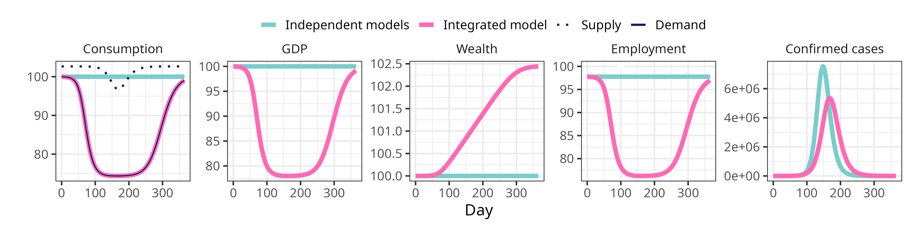

epi-SFC models
================


- [1 Econ models](#1-econ-models)
  - [1.1 Model 1: Integrating consumption and the
    epidemic](#11-model-1-integrating-consumption-and-the-epidemic)
    - [1.1.1 Model attributes](#111-model-attributes)
    - [1.1.2 Initial conditions](#112-initial-conditions)
    - [1.1.3 Resulting trajectories](#113-resulting-trajectories)
- [2 Epidemic model](#2-epidemic-model)
  - [2.1 Ordinary differential
    equations](#21-ordinary-differential-equations)
  - [2.2 Disease state transitions](#22-disease-state-transitions)

**To run the code**, type

``` r
source('R_script.R')
```

which will load also the files `data_file.Rds`, which contains stored
objects for parametrising the model; `functions.R`, which contains the
functions for solving the epidemiological model with odin and plotting
the results; and `econ_models.R`, which contains economic variables
which correspond to the overleaf document. There are two odin files,
`odin_model1.R` and `odin_model2.R`, which encode a single-variable
model (wealth) and a two-variable model (wealth and productivity),
respectively.

Other files contain code examples which are taken and adapted mostly
from <https://github.com/marcoverpas/Italy-SFC-Model> and
<https://github.com/marcoverpas/Six_lectures_on_sfc_models>.

# 1 Econ models

## 1.1 Model 1: Integrating consumption and the epidemic

<div class="figure">


<p class="caption">
<span id="fig:consumption"></span>Figure 1.1: Epi variables reduce
propensity to consume, which reduces consumption, and therefore GVA,
contacts, and new infections.
</p>

</div>

### 1.1.1 Model attributes

The first model has the following items. A name:

``` r
cat(model1$model_name)
```

    ## model1

Parameters (the $\alpha$ variables which represent propensity to
consume; $\theta$, which is the rate of tax; and $G$, government
spending, which in this model we keep constant):

``` r
cat(with(model1,c(alpha0, alpha1, alpha2, theta, G)))
```

    ## 0.01345824 0.7599207 1.46285e-05 0.1410444 0.009395317

The initial conditions for the time-varying quantities:

``` r
cat(model1$econ_init)
```

    ## 19.03266

The names of the econ variable(s) and the corresponding label(s):

``` r
cat(model1$econvarnames)
```

    ## H_h

``` r
cat(model1$econvarlabels)
```

    ## Wealth

The normal-times consumption, employment, size of the labour force, and
productivity:

``` r
cat(model1$cons0)
```

    ## 0.05721718

``` r
cat(model1$emp0)
```

    ## 45.06192

``` r
cat(model1$lf)
```

    ## 46.09208

``` r
cat(model1$lambda)
```

    ## 0.001478244

Annual GDP, which is used as the counterfactual for estimating loss:

``` r
cat(model1$gdp)
```

    ## 24.31356

### 1.1.2 Initial conditions

Using `wb_stats`, we get the following two annual variables, GDP and
taxes:

``` r
ref_year = 2023
gdp <- wb_data("NY.GDP.MKTP.CN",country = country, start_date = ref_year, end_date = ref_year)$NY.GDP.MKTP.CN/1e12/365
tax <- wb_data("GC.TAX.TOTL.CN",country = country, start_date = ref_year, end_date = ref_year)$GC.TAX.TOTL.CN/1e12/365
```

which gives GDP as 24 trillion PHP, and tax as 3.4 trillion PHP in the
year 2023.

We derive all other quantities from these two, given that

$$T = \theta Y$$ $$YD = {Y} - {T}$$ $${YD}(0) = {C}(0)$$
$${Y} = {C} + {G}$$

``` r
theta = tax / gdp 
yd0 = (1-theta)*gdp 
cons0 = yd0 
g0 = gdp - cons0 
```

so that the tax rate is $\theta = 0.14$; disposable income and
consumption are both 21 trillion PHP; and government spending is
$G = 3.4$ trillion PHP.

Given

$$ {H}_h(0) = \frac{(1 - \alpha_1){C}(0) - \alpha_0}{\alpha_2}$$

and our fitted values of $\alpha_1$ and $\alpha_2$ and sourced value of
wealth, ${H}_h = 19$ trillion PHP, we can compute
$\alpha_0 = 0.0134582$.

### 1.1.3 Resulting trajectories

<div class="figure">


<p class="caption">
<span id="fig:unnamed-chunk-10"></span>Figure 1.2: Results for model 1
with consumption reduction alongside counterfactual epi and econ curves
without integration.
</p>

</div>

# 2 Epidemic model

The epidemic model has:

- three age groups (children, working age, retirement age)
- working-age people stratified by those part of the labour force and
  those not part of the labour force
- six disease states (S, E, Iu (infected and will not be detected), Id
  (infected and will be detected), C (confirmed case), R)
- outputs from the econ model parametrise the function $k_{j}^{1}$

## 2.1 Ordinary differential equations

$$\begin{align}
\frac{d\mathcal{S}_{j}}{dt} & = - k_{j}^{(1)}(t)\mathcal{S}_{j}  \\
\frac{d\mathcal{E}_{j}}{dt} & = k_{j}^{(1)}(t)\mathcal{S}_{j} - (k^{(2)}+k^{(3)})\mathcal{E}_{j} \\
\frac{d\mathcal{I}_{j}^u}{dt} & = k^{(2)}\mathcal{E}_{j} - k^{(4)}\mathcal{I}_{j}^u \\
\frac{d\mathcal{I}_{j}^d}{dt} & = k^{(3)}\mathcal{E}_{j} - k^{(5)}\mathcal{I}_{j}^d \\
\frac{d\mathcal{C}_{j}}{dt} & = k^{(5)}\mathcal{I}_{j}^d - k^{(6)} \mathcal{C}_{j} \\
\frac{d\mathcal{R}_{j}}{dt} & = k^(4)\mathcal{I}_{j}^u + k^{(6)}\mathcal{C}_{j} \\
\end{align}$$

## 2.2 Disease state transitions

<div class="figure">


<p class="caption">
<span id="fig:statetransitions"></span>Figure 2.1: Disease state
transitions. $S$: susceptible. $E$: exposed. $I^{a}$: asymptomatic
infectious. $I^{s}$: symptomatic infectious. $H$: in need of
hospitalisation. $R$: recovered. $D$: died. $j$: stratum.
</p>

</div>

<!-- # References -->
